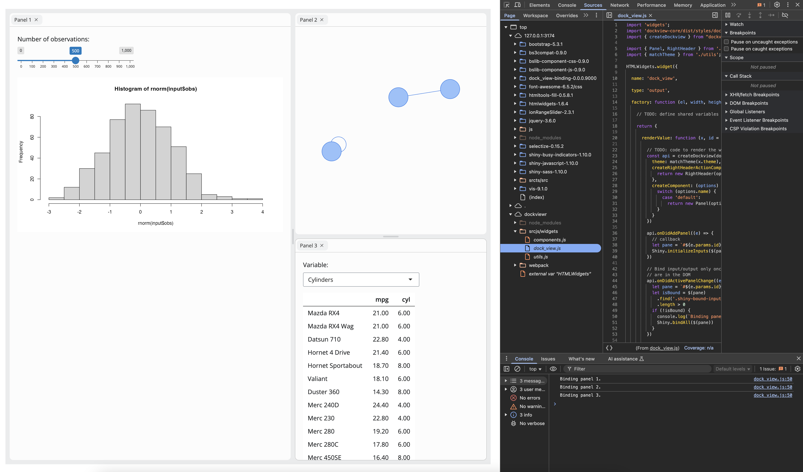

<!-- README.md is generated from README.Rmd. Please edit that file -->

# dockViewR

<!-- badges: start -->

[](https://lifecycle.r-lib.org/articles/stages.html#experimental)
[](https://CRAN.R-project.org/package=dockViewR)
[](https://github.com/cynkra/dockViewR/actions/workflows/R-CMD-check.yaml)
[](https://app.codecov.io/gh/cynkra/dockViewR)
<!-- badges: end -->

The goal of dockViewR is to provide a layout manager for Shiny apps and
interactive R documents. It builds on top of
[dockview](https://dockview.dev/).

## Installation

The latest version of the dockViewR package can be obtained from
[CRAN](https://CRAN.R-project.org/package=dockViewR):

``` r
# install.packages("pak")
pak::pak("dockViewR")
```

Or, you can install the development version of dockViewR like so:

``` r
pak::pak("cynkra/dockViewR")
```

## Example

This is a basic example which shows you how spin up a simple dockview
app:

``` r
library(shiny)
library(bslib)
library(visNetwork)
library(dockViewR)

nodes <- data.frame(id = 1:3)
edges <- data.frame(from = c(1, 2), to = c(1, 3))

ui <- page_fillable(
  dockViewOutput("dock")
)

server <- function(input, output, session) {
  exportTestValues(
    panel_ids = get_panels_ids("dock"),
    active_group = get_active_group("dock"),
    grid = get_grid("dock")
  )

  output$dock <- renderDockView({
    dock_view(
      panels = list(
        panel(
          id = "1",
          title = "Panel 1",
          content = tagList(
            sliderInput(
              "obs",
              "Number of observations:",
              min = 0,
              max = 1000,
              value = 500
            ),
            plotOutput("distPlot")
          )
        ),
        panel(
          id = "2",
          title = "Panel 2",
          content = tagList(
            visNetworkOutput("network")
          ),
          position = list(
            referencePanel = "1",
            direction = "right"
          ),
          minimumWidth = 500
        ),
        panel(
          id = "3",
          title = "Panel 3",
          content = tagList(
            selectInput(
              "variable",
              "Variable:",
              c("Cylinders" = "cyl", "Transmission" = "am", "Gears" = "gear")
            ),
            tableOutput("data")
          ),
          position = list(
            referencePanel = "2",
            direction = "below"
          )
        )
      ),
      theme = "replit"
    )
  })

  output$distPlot <- renderPlot({
    req(input$obs)
    hist(rnorm(input$obs))
  })

  output$network <- renderVisNetwork({
    visNetwork(nodes, edges, width = "100%")
  })

  output$data <- renderTable(
    {
      mtcars[, c("mpg", input$variable), drop = FALSE]
    },
    rownames = TRUE
  )
}

shinyApp(ui, server)
```

## Contributing

We welcome contributions! If you’d like to help improve `{dockViewR}`,
feel free to submit issues, feature requests, or pull requests.

### Knowledge pre-requisites

`{dockViewR}` is an **htmlwidget**, an interactive widget for R, powered
by a JS library. To get a minimum starting kit:

- JavaScript for R devs: <https://book.javascript-for-r.com/>.
- About htmlwidgets: <https://www.htmlwidgets.org/develop_intro.html>.

### Software pre-requisite

To contribute to this project, you’ll need `npm`, `node`, and the R
package `{packer}` to compile the JavaScript code. Please follow guide
[here](https://packer.john-coene.com/#/guide/installation). When you are
in the project, do the following:

``` r
pak::pak("packer")
# Restore JavaScript dependencies in package-lock.json (a bit like the renv.lock)
packer::npm_install()
```

The JS code uses [ES6
modules](https://developer.mozilla.org/en-US/docs/Web/JavaScript/Guide/Modules),
meaning that you can define a module in a `srcjs/component.js` script as
follows:

``` js
export const blabla = () => {
  console.log("Blabla");
}
```

and use it in another script, let’s say `./otherscript.js` like so:

``` js
// ./otherscript.js
import { blabla } from './components.js'
```

Whenever you are done with changing the JS script, you have to rebuild
it:

``` r
# Change the code and then rebundle
packer::bundle("development") # For developement mode
packer::bundle() # For production. Defaut!
```

You may as well bundle for `dev` using `packer::bundle_dev()` when in
developer mode and when ready for production use
`packer::bundle_prod()`. You may also consider `watch()` which watches
for changes in the `srcjs` and rebuilds if necessary, equivalent to
`⁠npm run watch⁠`.

### Debugging steps

1.  Whenever you run an app using `{dockViewR}`, like in
    `inst/examples/demo`, open the viewer on a web browser window
    (preferably Chrome as it is used to illustrate the action in this
    step, as other browser devtools differ in term of layout).
2.  Right-click on the widget and navigate to the `inspect` option on
    the drop-down menu.
3.  At the top, where the tabs are displayed, navigate to the `Sources`
    tab. Open from the sidepanel `dockviewer/srcjs/widgets/dockview.js`
    script . Once the
    `dockview.js` script is opened on the main panel. You can set a
    breakpoint on any line number of the script and reload the page.

## Acknowledgments

This package is built on top of the amazing
[dockview](https://dockview.dev/) JavaScript library.
